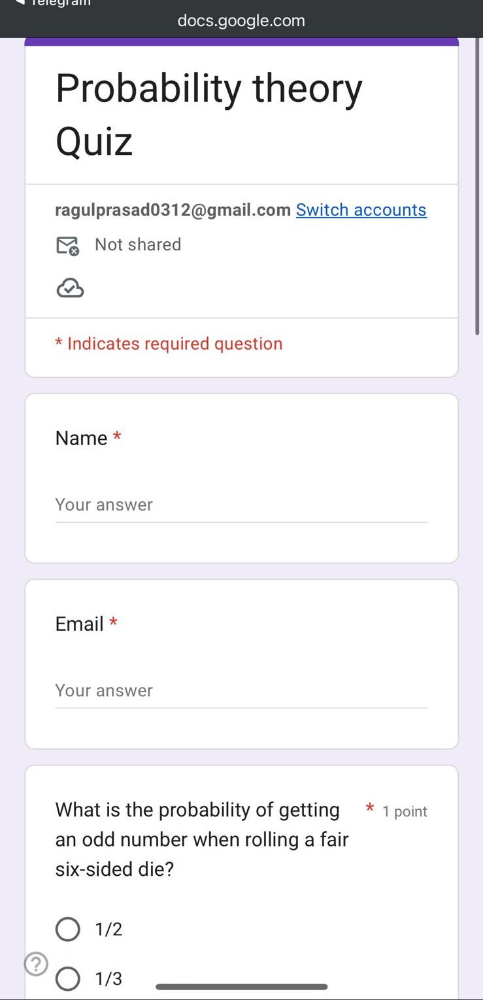

# Agentic Quiz System

An AI-powered quiz generation system that automatically creates quiz questions, evaluates responses, and stores results in Google Sheets.

## Features

* AI-generated quiz questions
* Automated answer evaluation
* Google Sheets integration for storing results
* Environment-based configuration
* Modular Python project structure

## Installation

### 1. Clone the repository

git clone https://github.com/yourusername/agentic-quiz-system.git

cd agentic-quiz-system

### 2. Create a virtual environment

python -m venv venv

### 3. Activate the environment

Windows:
venv\Scripts\activate

Mac/Linux:
source venv/bin/activate

### 4. Install dependencies

pip install -r requirements.txt

## Environment Variables

Create a `.env` file using `.env.example`.

Example:

OPENAI_API_KEY=your_api_key_here
GOOGLE_SHEET_ID=your_sheet_id
GOOGLE_CREDENTIALS_PATH=credentials.json

## Running the Project

Run the server using:

python test_ai.py

Or run the batch file:

run_server.bat

## Output Screenshots

### Quiz Generation

### AI Response

## Technologies Used

* Python
* OpenAI API
* Google Sheets API
* Environment Variables
* Virtual Environments

## Future Improvements

* Web interface for quizzes
* User authentication
* Dashboard for quiz analytics
* Better answer evaluation

## License

This project is for learning and demonstration purposes.
